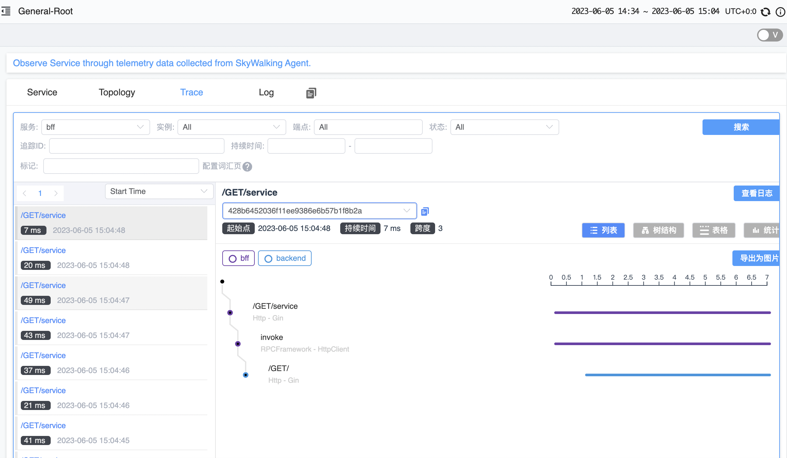
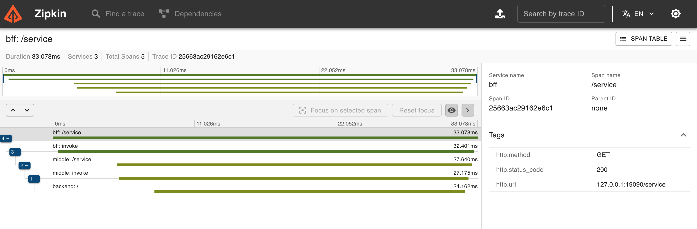

# httpbin 是什么？

httpbin 基于 Gin 开发，用于快速测试基于云原生微服务可观测性和流量管理等功能。

服务可观测性包括：
- 日志
- 指标
- 调用链路跟踪

流量管理包括：

- 网关
- Envoy & Istio
- 服务发现

# httpbin 1.0.1 版本

## 支持接口

````shell
GET    /metrics                  --> httpbin/pkg/middleware.(*metricMiddleWareBuilder).prometheusHandler.func1 (2 handlers)
GET    /                         --> httpbin/api.Anything (4 handlers)
POST   /                         --> httpbin/api.Anything (4 handlers)
GET    /hostname                 --> httpbin/api.HostName (4 handlers)
GET    /headers                  --> httpbin/api.Headers (4 handlers)
GET    /prob/liveness            --> httpbin/api.Healthz (4 handlers)
GET    /prob/livenessfile        --> httpbin/api.HealthzFile (4 handlers)
GET    /prob/readiness           --> httpbin/api.Readiness (4 handlers)
GET    /prob/readinessfile       --> httpbin/api.ReadinessFile (4 handlers)
GET    /prob/startup             --> httpbin/api.Startup (4 handlers)
GET    /prob/startupfile         --> httpbin/api.StartupFile (4 handlers)
GET    /data/bool                --> httpbin/api.Bool (4 handlers)
GET    /data/dto                 --> httpbin/api.ReponseAnyDto (4 handlers)
GET    /data/array               --> httpbin/api.ReponseAnyArray (4 handlers)
GET    /data/string              --> httpbin/api.ReponseAnyString (4 handlers)
GET    /service                  --> httpbin/api.Service (4 handlers)

````
## 支持功能

1. 支持 SkyWalking、Zipkin 调用链路跟踪
2. 支持 HTTP 接口 /metrics 指标输出
3. Readiness、Liveness、Startup 探针
4. 通过 /service?services=middle,backend 来模拟调用链路
5. grpc 接口

## 待支持功能

1. 支持日志集成 Trace
2. 接入 OpenTelemetry & Jaeger
3. Grafana metric 看板
4. 基于 Isito 流量管理样例
5. 其他 httpbin 原始接口迁移
6. 接入 Nacos 服务发现


# 使用

## 镜像下载

```shell
docker pull registry.cn-hangzhou.aliyuncs.com/2456868764/httpbin:v1.0.1
```

## 基本使用

1. 部署 deployment 

```shell
kubectl apply -f deploy/basic.yaml
```
2. 本地端口转发  

```shell
kubectl -n app-system port-forward service/basic  9090:80
```
3. 测试接口 /hostname 接口 输出 POD_NAME

```shell
curl -v http://127.0.0.1:9090/hostname 

"basic-6d6969cf9c-llzcp"
```

4. 测试 / 接口 输出整个请求头，请求参数，请求体，环境变量，调用链路等信息

```shell
curl -v http://127.0.0.1:9090/\?name\=httpbin
```
```json
{
  "args": {
    "name": "httpbin"
  },
  "form": {
    
  },
  "headers": {
    "accept": "*/*",
    "user-agent": "curl/7.64.1",
    "x-httpbin-trace-host": "basic-6d6969cf9c-llzcp",  # 调用链路中POD_NAME
    "x-httpbin-trace-service": "basic"                 # 调用链路中SERVICE_NAME
  },
  "method": "GET",
  "origin": "",
  "url": "/",
  "envs": {
    "BACKEND_PORT": "tcp://10.96.92.115:80",
    "BACKEND_PORT_80_TCP": "tcp://10.96.92.115:80",
    "BACKEND_PORT_80_TCP_ADDR": "10.96.92.115",
    "BACKEND_PORT_80_TCP_PORT": "80",
    "BACKEND_PORT_80_TCP_PROTO": "tcp",
    "BACKEND_SERVICE_HOST": "10.96.92.115",
    "BACKEND_SERVICE_PORT": "80",
    "BACKEND_SERVICE_PORT_HTTP": "80",
    "BASIC_PORT": "tcp://10.96.150.13:80",
    "BASIC_PORT_80_TCP": "tcp://10.96.150.13:80",
    "BASIC_PORT_80_TCP_ADDR": "10.96.150.13",
    "BASIC_PORT_80_TCP_PORT": "80",
    "BASIC_PORT_80_TCP_PROTO": "tcp",
    "BASIC_SERVICE_HOST": "10.96.150.13",
    "BASIC_SERVICE_PORT": "80",
    "BASIC_SERVICE_PORT_HTTP": "80",
    "BFF_PORT": "tcp://10.96.144.248:80",
    "BFF_PORT_80_TCP": "tcp://10.96.144.248:80",
    "BFF_PORT_80_TCP_ADDR": "10.96.144.248",
    "BFF_PORT_80_TCP_PORT": "80",
    "BFF_PORT_80_TCP_PROTO": "tcp",
    "BFF_SERVICE_HOST": "10.96.144.248",
    "BFF_SERVICE_PORT": "80",
    "BFF_SERVICE_PORT_HTTP": "80",
    "HOME": "/root",
    "HOSTNAME": "basic-6d6969cf9c-llzcp",
    "KUBERNETES_PORT": "tcp://10.96.0.1:443",
    "KUBERNETES_PORT_443_TCP": "tcp://10.96.0.1:443",
    "KUBERNETES_PORT_443_TCP_ADDR": "10.96.0.1",
    "KUBERNETES_PORT_443_TCP_PORT": "443",
    "KUBERNETES_PORT_443_TCP_PROTO": "tcp",
    "KUBERNETES_SERVICE_HOST": "10.96.0.1",
    "KUBERNETES_SERVICE_PORT": "443",
    "KUBERNETES_SERVICE_PORT_HTTPS": "443",
    "NODE_NAME": "higress-worker",
    "PATH": "/usr/local/sbin:/usr/local/bin:/usr/sbin:/usr/bin:/sbin:/bin",
    "POD_IP": "10.244.1.7",
    "POD_NAME": "basic-6d6969cf9c-llzcp",
    "POD_NAMESPACE": "app-system",
    "SERVICE_ACCOUNT": "basic",
    "SERVICE_NAME": "basic",
    "VERSION": "v1"
  },
  "host_name": "basic-6d6969cf9c-llzcp",
  "body": ""
}
```
5. 测试 /metrics 接口

```shell
curl -v http://127.0.0.1:9090/metrics 
# HELP app_request_duration_seconds The HTTP request latencies in seconds.
# TYPE app_request_duration_seconds histogram
app_request_duration_seconds_bucket{code="200",instance="basic-6d6969cf9c-llzcp",method="GET",service="basic",url="/",le="0.005"} 0
app_request_duration_seconds_bucket{code="200",instance="basic-6d6969cf9c-llzcp",method="GET",service="basic",url="/",le="0.01"} 1
app_request_duration_seconds_bucket{code="200",instance="basic-6d6969cf9c-llzcp",method="GET",service="basic",url="/",le="0.025"} 3
app_request_duration_seconds_bucket{code="200",instance="basic-6d6969cf9c-llzcp",method="GET",service="basic",url="/",le="0.05"} 4
app_request_duration_seconds_bucket{code="200",instance="basic-6d6969cf9c-llzcp",method="GET",service="basic",url="/",le="0.1"} 4
app_request_duration_seconds_bucket{code="200",instance="basic-6d6969cf9c-llzcp",method="GET",service="basic",url="/",le="0.25"} 4
app_request_duration_seconds_bucket{code="200",instance="basic-6d6969cf9c-llzcp",method="GET",service="basic",url="/",le="0.5"} 4
app_request_duration_seconds_bucket{code="200",instance="basic-6d6969cf9c-llzcp",method="GET",service="basic",url="/",le="1"} 4
app_request_duration_seconds_bucket{code="200",instance="basic-6d6969cf9c-llzcp",method="GET",service="basic",url="/",le="2.5"} 4
app_request_duration_seconds_bucket{code="200",instance="basic-6d6969cf9c-llzcp",method="GET",service="basic",url="/",le="5"} 4
app_request_duration_seconds_bucket{code="200",instance="basic-6d6969cf9c-llzcp",method="GET",service="basic",url="/",le="10"} 4
app_request_duration_seconds_bucket{code="200",instance="basic-6d6969cf9c-llzcp",method="GET",service="basic",url="/",le="+Inf"} 4
app_request_duration_seconds_sum{code="200",instance="basic-6d6969cf9c-llzcp",method="GET",service="basic",url="/"} 0.07803300099999999
app_request_duration_seconds_count{code="200",instance="basic-6d6969cf9c-llzcp",method="GET",service="basic",url="/"} 4
app_request_duration_seconds_bucket{code="200",instance="basic-6d6969cf9c-llzcp",method="GET",service="basic",url="/hostname",le="0.005"} 4
app_request_duration_seconds_bucket{code="200",instance="basic-6d6969cf9c-llzcp",method="GET",service="basic",url="/hostname",le="0.01"} 4
app_request_duration_seconds_bucket{code="200",instance="basic-6d6969cf9c-llzcp",method="GET",service="basic",url="/hostname",le="0.025"} 4
app_request_duration_seconds_bucket{code="200",instance="basic-6d6969cf9c-llzcp",method="GET",service="basic",url="/hostname",le="0.05"} 4
app_request_duration_seconds_bucket{code="200",instance="basic-6d6969cf9c-llzcp",method="GET",service="basic",url="/hostname",le="0.1"} 4
app_request_duration_seconds_bucket{code="200",instance="basic-6d6969cf9c-llzcp",method="GET",service="basic",url="/hostname",le="0.25"} 4
app_request_duration_seconds_bucket{code="200",instance="basic-6d6969cf9c-llzcp",method="GET",service="basic",url="/hostname",le="0.5"} 4
app_request_duration_seconds_bucket{code="200",instance="basic-6d6969cf9c-llzcp",method="GET",service="basic",url="/hostname",le="1"} 4
app_request_duration_seconds_bucket{code="200",instance="basic-6d6969cf9c-llzcp",method="GET",service="basic",url="/hostname",le="2.5"} 4
app_request_duration_seconds_bucket{code="200",instance="basic-6d6969cf9c-llzcp",method="GET",service="basic",url="/hostname",le="5"} 4
app_request_duration_seconds_bucket{code="200",instance="basic-6d6969cf9c-llzcp",method="GET",service="basic",url="/hostname",le="10"} 4
app_request_duration_seconds_bucket{code="200",instance="basic-6d6969cf9c-llzcp",method="GET",service="basic",url="/hostname",le="+Inf"} 4
app_request_duration_seconds_sum{code="200",instance="basic-6d6969cf9c-llzcp",method="GET",service="basic",url="/hostname"} 0.0007844589999999999
app_request_duration_seconds_count{code="200",instance="basic-6d6969cf9c-llzcp",method="GET",service="basic",url="/hostname"} 4
app_request_duration_seconds_bucket{code="200",instance="basic-6d6969cf9c-llzcp",method="GET",service="basic",url="/prob/liveness",le="0.005"} 346
app_request_duration_seconds_bucket{code="200",instance="basic-6d6969cf9c-llzcp",method="GET",service="basic",url="/prob/liveness",le="0.01"} 346
app_request_duration_seconds_bucket{code="200",instance="basic-6d6969cf9c-llzcp",method="GET",service="basic",url="/prob/liveness",le="0.025"} 346
app_request_duration_seconds_bucket{code="200",instance="basic-6d6969cf9c-llzcp",method="GET",service="basic",url="/prob/liveness",le="0.05"} 346
app_request_duration_seconds_bucket{code="200",instance="basic-6d6969cf9c-llzcp",method="GET",service="basic",url="/prob/liveness",le="0.1"} 346
app_request_duration_seconds_bucket{code="200",instance="basic-6d6969cf9c-llzcp",method="GET",service="basic",url="/prob/liveness",le="0.25"} 346
app_request_duration_seconds_bucket{code="200",instance="basic-6d6969cf9c-llzcp",method="GET",service="basic",url="/prob/liveness",le="0.5"} 346
app_request_duration_seconds_bucket{code="200",instance="basic-6d6969cf9c-llzcp",method="GET",service="basic",url="/prob/liveness",le="1"} 346
app_request_duration_seconds_bucket{code="200",instance="basic-6d6969cf9c-llzcp",method="GET",service="basic",url="/prob/liveness",le="2.5"} 346
app_request_duration_seconds_bucket{code="200",instance="basic-6d6969cf9c-llzcp",method="GET",service="basic",url="/prob/liveness",le="5"} 346
app_request_duration_seconds_bucket{code="200",instance="basic-6d6969cf9c-llzcp",method="GET",service="basic",url="/prob/liveness",le="10"} 346
app_request_duration_seconds_bucket{code="200",instance="basic-6d6969cf9c-llzcp",method="GET",service="basic",url="/prob/liveness",le="+Inf"} 346
app_request_duration_seconds_sum{code="200",instance="basic-6d6969cf9c-llzcp",method="GET",service="basic",url="/prob/liveness"} 0.024784950999999993
app_request_duration_seconds_count{code="200",instance="basic-6d6969cf9c-llzcp",method="GET",service="basic",url="/prob/liveness"} 346
app_request_duration_seconds_bucket{code="200",instance="basic-6d6969cf9c-llzcp",method="GET",service="basic",url="/prob/readiness",le="0.005"} 346
app_request_duration_seconds_bucket{code="200",instance="basic-6d6969cf9c-llzcp",method="GET",service="basic",url="/prob/readiness",le="0.01"} 346
app_request_duration_seconds_bucket{code="200",instance="basic-6d6969cf9c-llzcp",method="GET",service="basic",url="/prob/readiness",le="0.025"} 346
app_request_duration_seconds_bucket{code="200",instance="basic-6d6969cf9c-llzcp",method="GET",service="basic",url="/prob/readiness",le="0.05"} 346
app_request_duration_seconds_bucket{code="200",instance="basic-6d6969cf9c-llzcp",method="GET",service="basic",url="/prob/readiness",le="0.1"} 346
app_request_duration_seconds_bucket{code="200",instance="basic-6d6969cf9c-llzcp",method="GET",service="basic",url="/prob/readiness",le="0.25"} 346
app_request_duration_seconds_bucket{code="200",instance="basic-6d6969cf9c-llzcp",method="GET",service="basic",url="/prob/readiness",le="0.5"} 346
app_request_duration_seconds_bucket{code="200",instance="basic-6d6969cf9c-llzcp",method="GET",service="basic",url="/prob/readiness",le="1"} 346
app_request_duration_seconds_bucket{code="200",instance="basic-6d6969cf9c-llzcp",method="GET",service="basic",url="/prob/readiness",le="2.5"} 346
app_request_duration_seconds_bucket{code="200",instance="basic-6d6969cf9c-llzcp",method="GET",service="basic",url="/prob/readiness",le="5"} 346
app_request_duration_seconds_bucket{code="200",instance="basic-6d6969cf9c-llzcp",method="GET",service="basic",url="/prob/readiness",le="10"} 346
app_request_duration_seconds_bucket{code="200",instance="basic-6d6969cf9c-llzcp",method="GET",service="basic",url="/prob/readiness",le="+Inf"} 346
app_request_duration_seconds_sum{code="200",instance="basic-6d6969cf9c-llzcp",method="GET",service="basic",url="/prob/readiness"} 0.011009689000000008
app_request_duration_seconds_count{code="200",instance="basic-6d6969cf9c-llzcp",method="GET",service="basic",url="/prob/readiness"} 346
# HELP app_request_size_bytes The HTTP request sizes in bytes.
# TYPE app_request_size_bytes summary
app_request_size_bytes_sum{instance="basic-6d6969cf9c-llzcp",service="basic"} 61030
app_request_size_bytes_count{instance="basic-6d6969cf9c-llzcp",service="basic"} 700
# HELP app_requests_total How many HTTP requests processed, partitioned by status code and HTTP method.
# TYPE app_requests_total counter
app_requests_total{code="200",handler="httpbin/api.Anything",host="127.0.0.1:8080",instance="basic-6d6969cf9c-llzcp",method="GET",service="basic",url="/"} 4
app_requests_total{code="200",handler="httpbin/api.Healthz",host="10.244.1.7:80",instance="basic-6d6969cf9c-llzcp",method="GET",service="basic",url="/prob/liveness"} 346
app_requests_total{code="200",handler="httpbin/api.HostName",host="127.0.0.1:8080",instance="basic-6d6969cf9c-llzcp",method="GET",service="basic",url="/hostname"} 4
app_requests_total{code="200",handler="httpbin/api.Readiness",host="10.244.1.7:80",instance="basic-6d6969cf9c-llzcp",method="GET",service="basic",url="/prob/readiness"} 346
# HELP app_response_size_bytes The HTTP response sizes in bytes.
# TYPE app_response_size_bytes summary
app_response_size_bytes_sum{instance="basic-6d6969cf9c-llzcp",service="basic"} 13848
app_response_size_bytes_count{instance="basic-6d6969cf9c-llzcp",service="basic"} 700
# HELP go_gc_duration_seconds A summary of the pause duration of garbage collection cycles.

```

## 调用链路使用

### SkyWalking

1. 部署

```shell
kubectl apply -f deploy/skywalking.yaml
kubectl apply -f deploy/app-skywalking.yaml
```
2. 检查 Pod 情况

```shell
kubectl get pods -n app-system
NAME                       READY   STATUS    RESTARTS   AGE
backend-6b9549bc64-ggpws   1/1     Running   1          20h
bff-756955bb86-465zl       1/1     Running   1          20h

kubectl get pods -n op-system 
NAME                                        READY   STATUS    RESTARTS   AGE
skywalking-oap-dashboard-65f496ccc9-zfrsd   1/1     Running   1          23h
skywalking-oap-server-859694656b-7s569      1/1     Running   1          23h

```
3. SkyWalking dashboard 和 bff 服务端口转发

```shell
kubectl -n op-system port-forward service/skywalking-oap-dashboard 8080:8080
kubectl -n app-system port-forward service/bff 9090:80
```

4. 模拟调用链路 通过 bff 服务调用 backend 服务

```shell
curl -v http://127.0.0.1:9090/service\?services\=backend

{
  "args": {
    
  },
  "form": {
    
  },
  "headers": {
    "accept-encoding": "gzip",
    "sw8": "1-ZjJjYWU1MzcwMzZkMTFlZWE0YmRlMmZkNDMzZTlkNTc=-ZjJjYWU1NWMwMzZkMTFlZWE0YmRlMmZkNDMzZTlkNTc=-1-YmZm-YmZmLTc1Njk1NWJiODYtNDY1emw=-L0dFVC9zZXJ2aWNl-aHR0cDovL2JhY2tlbmQv",
    "sw8-correlation": "",
    "user-agent": "Go-http-client/1.1",
    "x-httpbin-trace-host": "bff-756955bb86-465zl/backend-6b9549bc64-ggpws",
    "x-httpbin-trace-service": "bff/backend"
  },
  "method": "GET",
  "origin": "",
  "url": "/",
  "envs": {
    "BACKEND_PORT": "tcp://10.96.92.115:80",
    "BACKEND_PORT_80_TCP": "tcp://10.96.92.115:80",
    "BACKEND_PORT_80_TCP_ADDR": "10.96.92.115",
    "BACKEND_PORT_80_TCP_PORT": "80",
    "BACKEND_PORT_80_TCP_PROTO": "tcp",
    "BACKEND_SERVICE_HOST": "10.96.92.115",
    "BACKEND_SERVICE_PORT": "80",
    "BACKEND_SERVICE_PORT_HTTP": "80",
    "BASIC_PORT": "tcp://10.96.150.13:80",
    "BASIC_PORT_80_TCP": "tcp://10.96.150.13:80",
    "BASIC_PORT_80_TCP_ADDR": "10.96.150.13",
    "BASIC_PORT_80_TCP_PORT": "80",
    "BASIC_PORT_80_TCP_PROTO": "tcp",
    "BASIC_SERVICE_HOST": "10.96.150.13",
    "BASIC_SERVICE_PORT": "80",
    "BASIC_SERVICE_PORT_HTTP": "80",
    "BFF_PORT": "tcp://10.96.144.248:80",
    "BFF_PORT_80_TCP": "tcp://10.96.144.248:80",
    "BFF_PORT_80_TCP_ADDR": "10.96.144.248",
    "BFF_PORT_80_TCP_PORT": "80",
    "BFF_PORT_80_TCP_PROTO": "tcp",
    "BFF_SERVICE_HOST": "10.96.144.248",
    "BFF_SERVICE_PORT": "80",
    "BFF_SERVICE_PORT_HTTP": "80",
    "HOME": "/root",
    "HOSTNAME": "backend-6b9549bc64-ggpws",
    "KUBERNETES_PORT": "tcp://10.96.0.1:443",
    "KUBERNETES_PORT_443_TCP": "tcp://10.96.0.1:443",
    "KUBERNETES_PORT_443_TCP_ADDR": "10.96.0.1",
    "KUBERNETES_PORT_443_TCP_PORT": "443",
    "KUBERNETES_PORT_443_TCP_PROTO": "tcp",
    "KUBERNETES_SERVICE_HOST": "10.96.0.1",
    "KUBERNETES_SERVICE_PORT": "443",
    "KUBERNETES_SERVICE_PORT_HTTPS": "443",
    "NODE_NAME": "higress-worker",
    "PATH": "/usr/local/sbin:/usr/local/bin:/usr/sbin:/usr/bin:/sbin:/bin",
    "POD_IP": "10.244.1.5",
    "POD_NAME": "backend-6b9549bc64-ggpws",
    "POD_NAMESPACE": "app-system",
    "SERVICE_ACCOUNT": "backend",
    "SERVICE_NAME": "backend",
    "VERSION": "v1"
  },
  "host_name": "backend-6b9549bc64-ggpws",
  "body": ""
}
```

这里 x-httpbin-trace-host 和 x-httpbin-trace-service 是调用链路经过的 POD_NAME 和 SERVICE_NAME
- "x-httpbin-trace-host": "bff-756955bb86-465zl/backend-6b9549bc64-ggpws"
- "x-httpbin-trace-service": "bff/backend"

SkyWalking dashboard 的调用链路如下：



### Zipkin

1. 部署

```shell
kubectl apply -f deploy/zipkin.yaml
kubectl apply -f deploy/app-zipkin.yaml
```

2. 检查 Pod 情况

```shell
kubectl get pods -n app-system
NAME                       READY   STATUS    RESTARTS   AGE
backend-85d757cf55-9fndf   1/1     Running   0          37s
middle-7bc5b548bb-nbv7p    1/1     Running   0          37s
bff-cb44846fc-b9498        1/1     Running   0          37s

kubectl get pods -n zipkin
NAME                    READY   STATUS    RESTARTS   AGE
zipkin-7dc6bbcb-gqs2q   1/1     Running   0          75s

```
3. Zipkin dashboard 和 bff 服务端口转发

```shell
kubectl -n zipkin port-forward service/zipkin 9411:9411
kubectl -n app-system port-forward service/bff 9090:80
```

4. 模拟调用链路 通过 bff 服务调用 backend 服务

```shell
curl -v "http://127.0.0.1:9090/service?services=middle,backend"

{
  "args": {},
  "form": {},
  "headers": {
    "accept-encoding": "gzip",
    "user-agent": "Go-http-client/1.1,Go-http-client/1.1,curl/8.6.0",
    "x-b3-parentspanid": "6bdef451db01ae35,25663ac29162e6c1",
    "x-b3-sampled": "1,1",
    "x-b3-spanid": "4edb277843b00135,4f96de60f92193af",
    "x-b3-traceid": "25663ac29162e6c1,25663ac29162e6c1",
    "x-httpbin-trace-host": "bff-678768bd7b-qkphq/middle-8bd667d7-2gwln/backend-6b545bc774-jc69x",
    "x-httpbin-trace-service": "bff/middle/backend"
  },
  "method": "GET",
  "origin": "",
  "url": "/",
  "envs": {
    "BACKEND_PORT": "tcp://10.43.185.213:80",
    "BACKEND_PORT_80_TCP": "tcp://10.43.185.213:80",
    "BACKEND_PORT_80_TCP_ADDR": "10.43.185.213",
    "BACKEND_PORT_80_TCP_PORT": "80",
    "BACKEND_PORT_80_TCP_PROTO": "tcp",
    "BACKEND_SERVICE_HOST": "10.43.185.213",
    "BACKEND_SERVICE_PORT": "80",
    "BACKEND_SERVICE_PORT_HTTP": "80",
    "BFF_PORT": "tcp://10.43.235.31:80",
    "BFF_PORT_80_TCP": "tcp://10.43.235.31:80",
    "BFF_PORT_80_TCP_ADDR": "10.43.235.31",
    "BFF_PORT_80_TCP_PORT": "80",
    "BFF_PORT_80_TCP_PROTO": "tcp",
    "BFF_SERVICE_HOST": "10.43.235.31",
    "BFF_SERVICE_PORT": "80",
    "BFF_SERVICE_PORT_HTTP": "80",
    "HOME": "/root",
    "HOSTNAME": "backend-6b545bc774-jc69x",
    "KUBERNETES_PORT": "tcp://10.43.0.1:443",
    "KUBERNETES_PORT_443_TCP": "tcp://10.43.0.1:443",
    "KUBERNETES_PORT_443_TCP_ADDR": "10.43.0.1",
    "KUBERNETES_PORT_443_TCP_PORT": "443",
    "KUBERNETES_PORT_443_TCP_PROTO": "tcp",
    "KUBERNETES_SERVICE_HOST": "10.43.0.1",
    "KUBERNETES_SERVICE_PORT": "443",
    "KUBERNETES_SERVICE_PORT_HTTPS": "443",
    "MIDDLE_PORT": "tcp://10.43.222.228:80",
    "MIDDLE_PORT_80_TCP": "tcp://10.43.222.228:80",
    "MIDDLE_PORT_80_TCP_ADDR": "10.43.222.228",
    "MIDDLE_PORT_80_TCP_PORT": "80",
    "MIDDLE_PORT_80_TCP_PROTO": "tcp",
    "MIDDLE_SERVICE_HOST": "10.43.222.228",
    "MIDDLE_SERVICE_PORT": "80",
    "MIDDLE_SERVICE_PORT_HTTP": "80",
    "NODE_NAME": "k3d-zipkin-demo-server-0",
    "PATH": "/usr/local/sbin:/usr/local/bin:/usr/sbin:/usr/bin:/sbin:/bin",
    "POD_IP": "10.42.0.78",
    "POD_NAME": "backend-6b545bc774-jc69x",
    "POD_NAMESPACE": "app-system",
    "SERVICE_ACCOUNT": "backend",
    "SERVICE_NAME": "backend",
    "VERSION": "v1"
  },
  "host_name": "backend-6b545bc774-jc69x",
  "body": ""
}
```
Zipkin dashboard 的调用链路如下：



## grpc 
### 激活 grpc 功能

使用 --grpc-enable 参数开启 grpc 监听，--grpc-port 指定监听端口， 默认监听 9090 端口， protobuf 文件在 pkg/order/order.proto

### 测试

```shell
grpcurl -plaintext 127.0.0.1:9090 list

grpc.reflection.v1.ServerReflection
grpc.reflection.v1alpha.ServerReflection
order.OrderManagement
```

```shell        
grpcurl -plaintext -d '{"name": "jun"}' 127.0.0.1:9090 order.OrderManagement/sayHello

"Hello jun"
```

